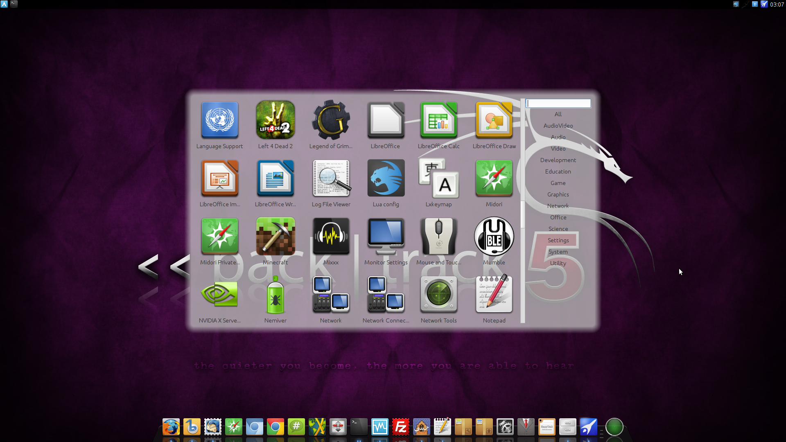

Rocket-Launcher
===============

Rocket-Launcher is an application launcher that is supposed to be fast and relatively lightweight.

It is written in Vala and uses GTK+ 3 as well as some own drawing with Cairo for its gui.

Rocket-Launcher aims to be the only application you ever need, while focusing on the core component: Starting Applications.

I generally try to follow [The Arch Way](https://wiki.archlinux.org/index.php/The_Arch_Way).  
("simplicity as without unnecessary additions, modifications, or complications")

This is why Rocket-Launcher does not have support for Searching Documents, SSH, *Zeitgeit*, Controlling Music, etc.

On the other side Rocket-Launcher can be built with minimal dependencies, so it works great on a minimalistic system which does not have *Zeitgeist*, *librest*, *libunique* the *appindicator* library or even *automake*.

